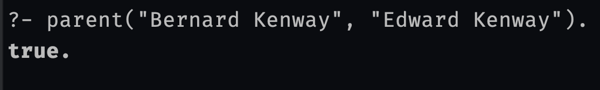
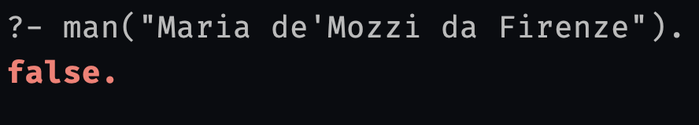
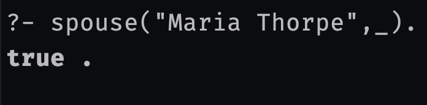
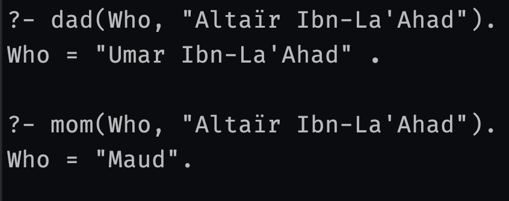
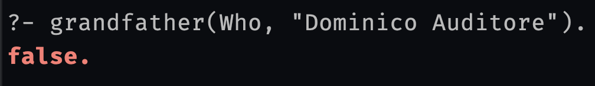
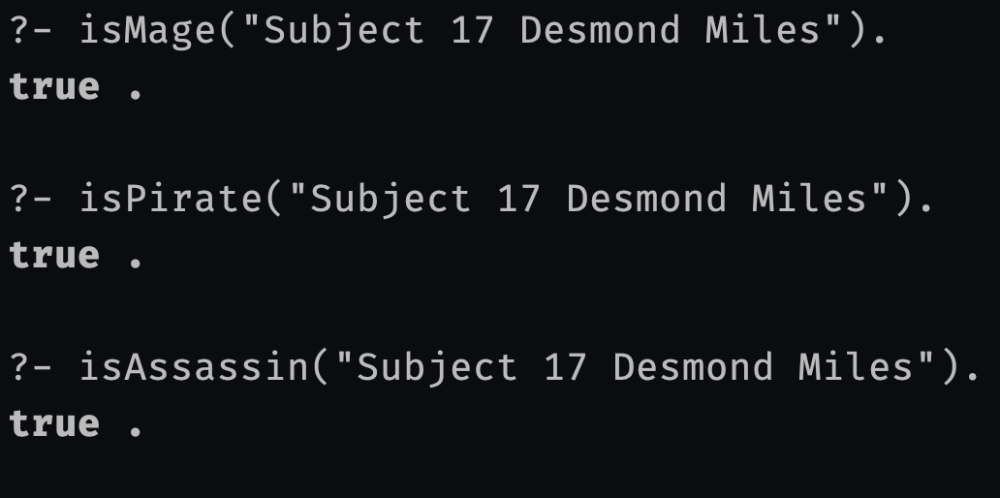
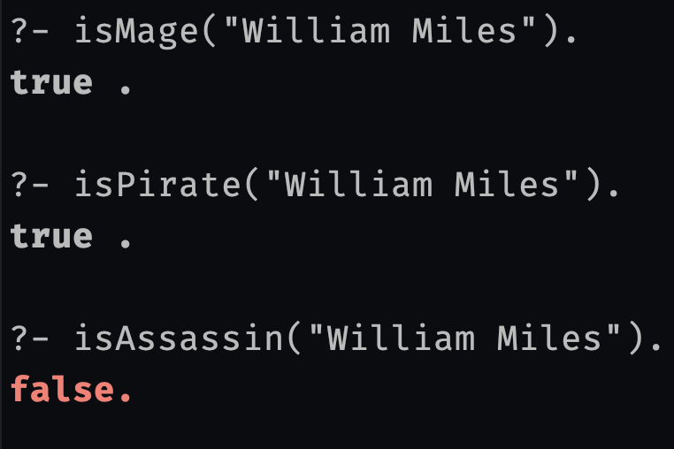

# Лабораторная 1. Создание базы знаний и выполнение запросов в Prolog

Требуется создать базу знаний в языке программирования Prolog и реализовать набор запросов, используя эту базу знаний. Задача направлена на развитие навыков работы с фактами, предикатами, и правилами в логическом программировании.

## Задание

### Создание базы знаний:

Создайте базу знаний. База знаний должна включать в себя не менее 20 фактов с одним аргументом, 10-15 фактов с двумя аргументам, которые дополняют и показывают связь с другими фактами и 5-7 правил. Факты могут описывать объекты, их свойства и отношения между ними. Предикаты могут описывать различные атрибуты объектов, а правила - логические законы и выводы, которые можно сделать на основе фактов и предикатов.

### Выполнение запросов:

Напишите несколько запросов для БЗ. Запросы должны быть разной сложности и включать в себя:

* Простые запросы к базе знаний для поиска фактов.
* Запросы, использующие логические операторы (и, или, не) для формулирования сложных условий.
* Запросы, использующие переменные для поиска объектов с определенными характеристиками.
* Запросы, которые требуют выполнения правил для получения результата.

## Критерии оценки

* Корректность базы знаний и выполненных запросов.
* Сложность и разнообразие запросов.
* Качество документации и комментариев к коду.

## Выбранная тематика БЗ:

Генеалогическое дерево вселенной игры Assassin's creed

## Реализация

### В [представленном файле](src%2Fmain.pl) определены:

1) База знаний, которая включает следующие факты:

   |     Факт     |          Описание           |
   |:------------:|:---------------------------:|
   | parent(X, Y) |   X является родителем Y    |
   |    man(X)    |     X является мужчиной     |
   |   woman(X)   |     X является женщиной     |
   |   mage(X)    |      X является магом       |
   |  pirate(X)   |     X является пиратом      |
   | assassin(X)  | X является скрытным убийцей |
   | spouse(X, Y) | X является супругом(-ой) Y  |

2) Правила, способные породить следующие факты:

|       Факт        |                                 Описание                                 |
|:-----------------:|:------------------------------------------------------------------------:|
|   spouse(X, Y)    | вспомогательное правило, определяющее симметричную связь между супругами |
|     son(X, Y)     |                            X является сыном Y                            |
|  daughter(X, Y)   |                           X является дочерью Y                           |
|     mom(X, Y)     |                           X является матерью Y                           |
|     dad(X, Y)     |                            X является отцом Y                            |
| grandfather(X, Y) |                          X является дедушкой Y                           |
| grandmother(X, Y) |                          X является бабушкой Y                           |
|     isMage(X)     |                        Является ли X предком мага                        |
|    isPirate(X)    |                       Является ли X предком пирата                       |
|   isAssassin(X)   |                  Является ли X предком скрытного убийцы                  |

### Таким образом, в базе знаний находятся:

|                          Элемент БЗ                           | Количество |
|:-------------------------------------------------------------:|:----------:|
|                   Фактов с одним аргументом                   |     30     |
|                  Фактов с двумя аргументами                   |     36     |
|                            Правил                             |     10     |

## Запросы к базе знаний:

Для осуществления запросов я бы хотел воспользоваться сервисом https://swish.swi-prolog.org/, однако в самый нужный момент сайт лёг, поэтому мне пришлось загрузить интерпретатор Prolog на свой ноутбук.
Для запуска интерпретатора введём команду `swipl <filename>.pl` в директории с файлом и начнем производить запросы разной сложности:

|         Запросы и их результаты         |
|:---------------------------------------:|
|   |
|  |
|  |
|  |
|  |
|  |
|  |

## Вывод

В ходе лабораторной работы я научился логическому программированию на языке Prolog. Оперируя фактами (объекты и отношения между ними), я создал базу знаний. После чего я определил некоторые правила, благодаря которым смог порождать новые факты на основе имеющихся.
