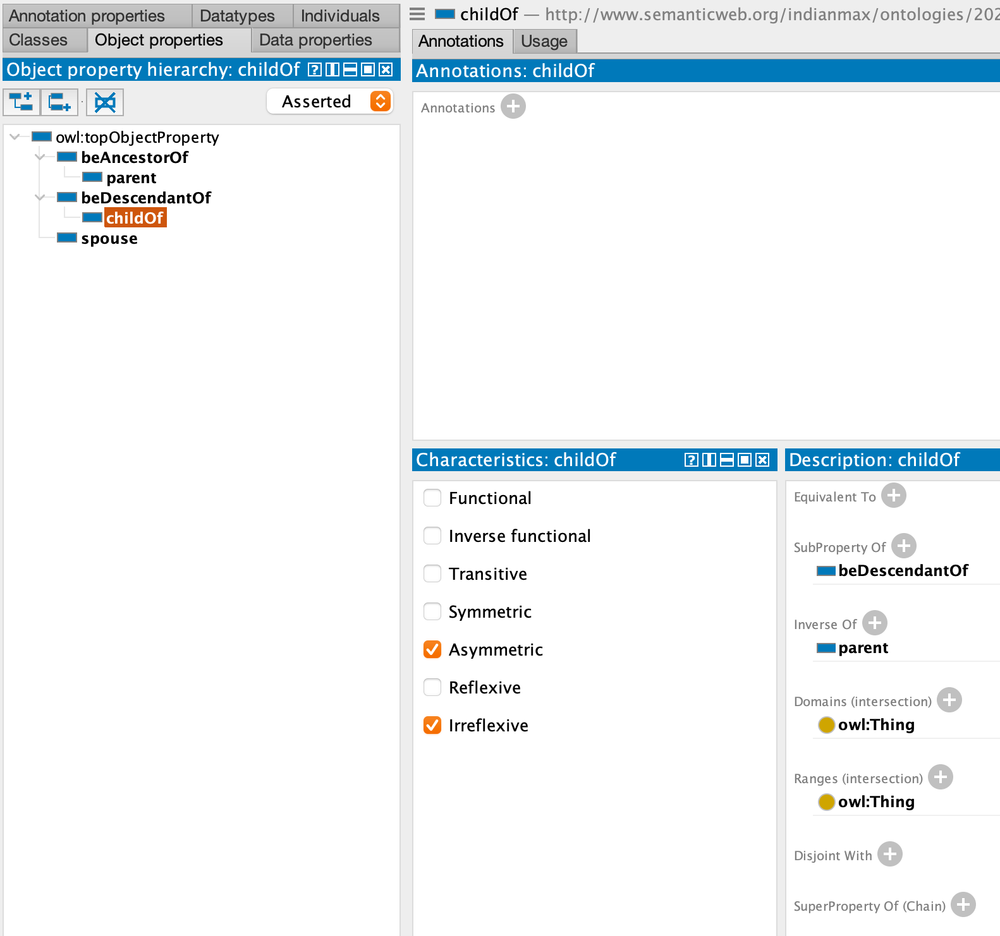
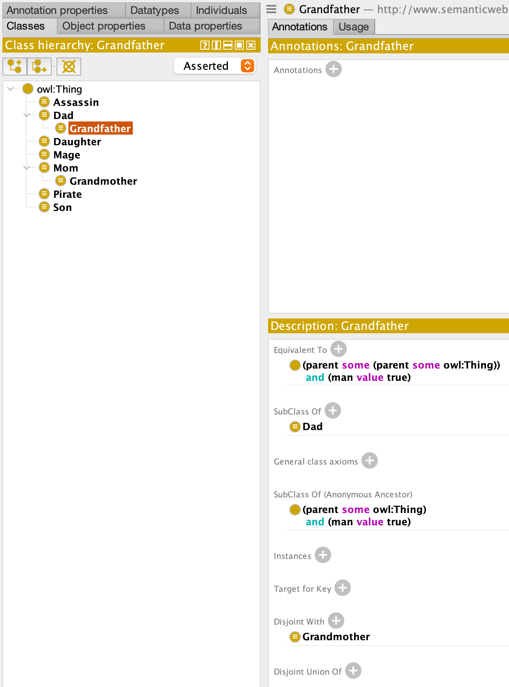

# Лабораторная работа 2. Создание онтологии в Protege

Целью этой лабораторной работы является знакомство со средой разработки онтологий Protege и перевод базы знаний, созданной в предыдущей лабораторной работе в онтологическую форму в Protege.

## Задание

Преобразовать факты и отношения из Prolog в концепты и свойства в онтологии. Описать классы и свойства в онтологии, которые соответствуют объектам и отношениям из базы знаний. Например, если у были классы "Человек" и "Машина" и свойство "возраст", создайте аналогичные классы и свойства в онтологии в Protege.

## Критерии оценки

- Корректное создание онтологии в Protege на основе базы знаний в Prolog.
- Качество перевода фактов, предикатов и отношений из Prolog в онтологию.
- Определение классов, свойств и иерархии классов в Protege.
- Тестирование онтологии и демонстрация ее функциональности.

## Реализация

### Отобразим факты базы знаний на предикаты онтологии (ObjectProperties/DataProperties):

|                       Предикат                       |
|:----------------------------------------------------:|
|  |            
|  |
|  |
|  |
|  |
|  |
|  |

### В связи с особенностями строения онтологии, определим правила базы знаний как классы, используя определенные ранее предикаты. Помимо этого, для отображения рекурсии предков, определим причастие (ярлык) также через класс:

|                    Класс                     |
|:--------------------------------------------:|
|  |
|  |
|  |
|  |
|  |
|  |
|  |
|  |
|  |

### Запустим Reasoner и выполним запросы:

|                 Запрос                 |            Комментарий             |
|:--------------------------------------:|:----------------------------------:|
|  |             Все матери             |
|  | Все матери, являющиеся Ассассинами |
|  | Пират, Маг и Ассассин одновременно |
|  |     Является ли Maud женщиной      |
|  |  Является ли William_Miles мамой   |

## Вывод

В результате работы я создал онтологию в Protege на основе базы знаний в Prolog путём отображения фактов, предикатов и отношений из Prolog в онтологию. Также я выполнил запросы в онтологию для обнаружения скрытых фактов.
