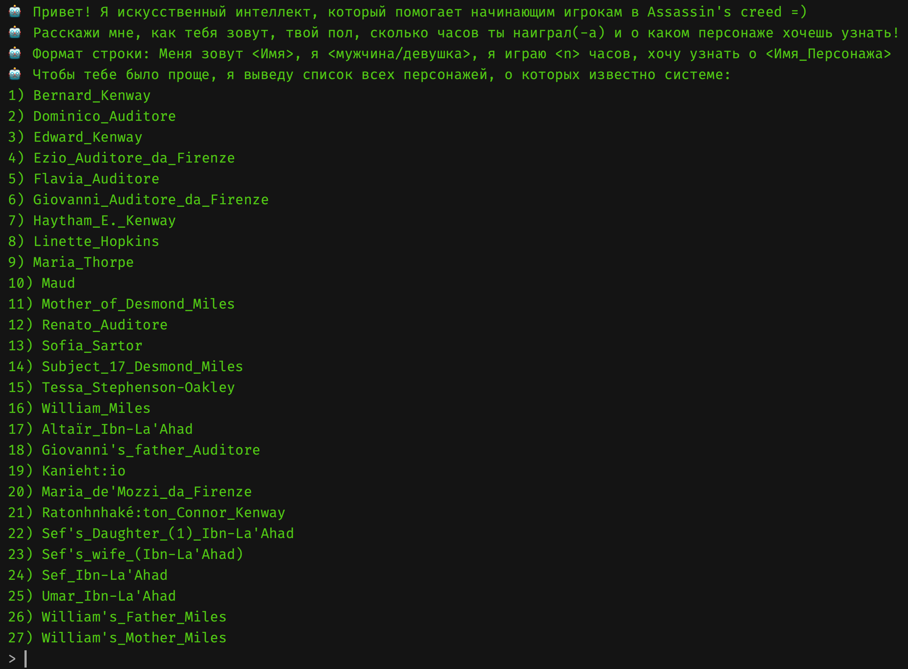
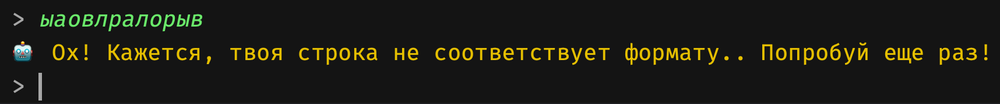
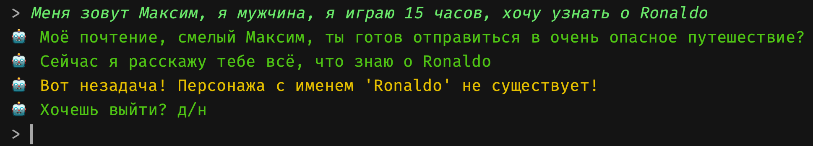
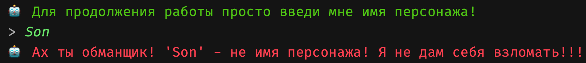
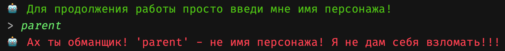
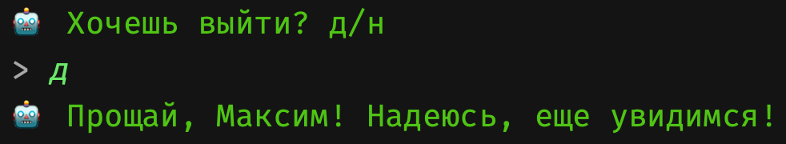

# Лабораторная работа №3. Разработка системы поддержки принятия решения на основе базы знаний или онтологии

Целью этой лабораторной работы является разработка программы, которая будет использовать базу знаний или онтологию для предоставления рекомендаций на основе введенных пользователем данных.

## Задание

- Создать программу, которая позволяет пользователю ввести запрос через командную строку. Например, информацию о себе, своих интересах и предпочтениях в контексте выбора видеоигры - на основе фактов из БЗ/Онтологии.
- Использовать введенные пользователем данные, чтобы выполнить логические запросы к  БЗ/Онтологии.
- На основе полученных результатов выполнения запросов, система должна предоставить рекомендации или советы, связанные с выбором из БЗ или онтологии.

## Пример

### Входная строка:

Мне 13 лет, мне нравятся: RPG, инди-игры

### Нужно:

Спарсить строку, разбить на факты, построить запрос, используя эти предикаты. (Формат входной строки фиксированный, искать частичное соответсвие подстроки не нужно)

## Критерии оценки:

- Корректность и эффективность реализации системы поддержки принятия решения.
- Способность программы адекватно использовать базу знаний или онтологию для выдачи рекомендаций.
- Качество тестирования и обработка ввода пользователя.
- Качество документации и описание работы системы.

## Реализация

Реализация доступна [здесь](https://github.com/IndianMax03/ais-labs/blob/ede882089dc7d16da221660621739308845c738b/module1/lab3/src/assassins).

### Общая информация о проеке assassins:

|           Характеристика           |                       Реализация                        |
|:----------------------------------:|:-------------------------------------------------------:|
|           Тип приложения           |                       Консольное                        |
|       Язык программирования        |                         Python                          |
| Библиотека для работы с онтологией | [owlready2](https://owlready2.readthedocs.io/en/v0.44/) |

### Демонстрация работы приложения

|       Скриншот работы программы        |                 Действие                  |
|:--------------------------------------:|:-----------------------------------------:|
|  | Запуск, приветствие и приглашение к вводу |
|  |          Неверный формат строки           |
|  |     Individuals не найден в онтологии     |
|  |      Продолжение поиска по онтологии      |
|  |         Инъекция с помощью класса         |
|  |       Инъекция с помощью properties       |
|  |   Валидное завершение работы программы    |

## Вывод

В ходе работы я научился оперировать средствами онтологий (.owl файлами) в Python: осуществлять запросы на проверку/поиск/обнаружение фактов. Моя система способна помогать игроку, желающему больше узнать о мире ассассинов, потому что экшен во время игры часто отвлекает от сюжетной линии и линии наследия.
